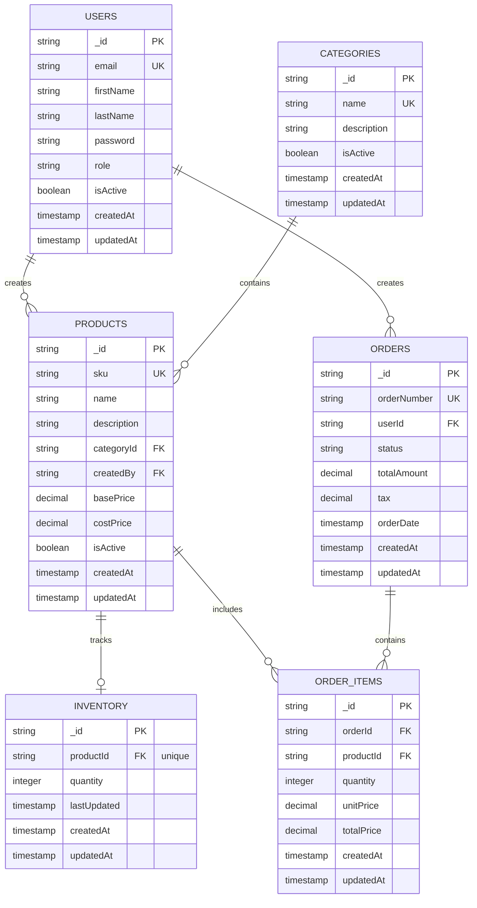

# Inventory Management API

A REST API for inventory management built with Node.js, Express, MongoDB, and Mongoose. Supports two user roles — **admin** and **employee** — with JWT authentication, role-based access control, and full CRUD across categories, products, inventory, and orders.

---

## Table of Contents

- [Project Structure](#project-structure)
- [Architecture & Request Lifecycle](#architecture--request-lifecycle)
- [Data Model](#data-model)
- [Authentication & Authorization](#authentication--authorization)
- [API Reference](#api-reference)
- [Role Permissions Matrix](#role-permissions-matrix)
- [Order & Inventory Logic](#order--inventory-logic)
- [Error Handling](#error-handling)
- [Environment Variables](#environment-variables)
- [Getting Started](#getting-started)
- [Tech Stack](#tech-stack)

---

## Project Structure

```
├── server.js                    # Entry point — loads env, connects DB, starts server
├── app.js                       # Express app — middleware, route mounting, 404 handler
├── .env.example                 # Environment variable template
├── diagram.png                  # Entity relationship diagram
│
├── config/
│   └── db.js                    # Mongoose connectDB() — exits process on failure
│
├── models/
│   ├── User.js                  # bcrypt pre-save hook; password stripped from all responses
│   ├── Category.js
│   ├── Product.js
│   ├── Inventory.js             # 1-to-1 with Product (productId is unique)
│   ├── Order.js                 # Status enum: pending / processing / completed / cancelled
│   └── OrderItem.js             # Line items linking Orders to Products
│
├── middleware/
│   ├── auth.js                  # protect — verifies JWT, checks isActive, attaches req.user
│   └── authorize.js             # RBAC — higher-order fn, checks req.user.role
│
├── controllers/
│   ├── authController.js
│   ├── categoryController.js
│   ├── productController.js
│   ├── inventoryController.js
│   └── orderController.js
│
├── services/
│   ├── authService.js           # registerUser, loginUser, getCurrentUser, JWT signing
│   ├── categoryService.js       # CRUD for categories
│   ├── productService.js        # CRUD, scoped by role (employees see own, admins see all)
│   ├── inventoryService.js      # CRUD, duplicate guard, lastUpdated on every patch
│   └── orderService.js          # Stock validation + deduction on create; stock restore on cancel
│
├── routes/
│   ├── authRoutes.js
│   ├── categoryRoutes.js
│   ├── productRoutes.js
│   ├── inventoryRoutes.js
│   └── orderRoutes.js
│
└── utils/
    └── httpError.js             # Reads err.statusCode, falls back to 500
```

---

## Architecture & Request Lifecycle

The project follows a strict 4-layer architecture. Each layer has one job and no awareness of the layers above it.

```
Request
   │
   ▼
Route          — declares the path, applies protect / authorize middleware
   │
   ▼
Controller     — calls the service, returns JSON or forwards the error
   │
   ▼
Service        — all business logic; receives req.user for role-based scoping
   │
   ▼
Model          — Mongoose schema; communicates with MongoDB
```

Every controller follows the same shape — no business logic, just delegation:

```js
async function createProduct(req, res) {
  try {
    const product = await productService.createProduct(req.user, req.body);
    return res.status(201).json(product);
  } catch (err) {
    return res.status(getHttpStatusCode(err)).json({ message: err.message });
  }
}
```

Services receive `req.user` directly. Role-scoping (employees see their own records, admins see everything) is decided entirely inside the service — routes and controllers are role-agnostic.

---

## Data Model



### Key relationships

- **USERS** create **PRODUCTS** and place **ORDERS**
- **CATEGORIES** contain **PRODUCTS** (each product belongs to one category)
- **PRODUCTS** are tracked by exactly one **INVENTORY** record (`productId` is unique — enforced at the schema level)
- **ORDERS** contain one or more **ORDER_ITEMS**, each referencing a product and capturing the unit price at the time of the order

### Notable schema rules

| Model      | Notable constraints |
|------------|---------------------|
| User       | `password` has `select: false` — never returned in queries; `toJSON` also strips it and `__v` |
| User       | `pre('save')` hook hashes the password with bcrypt (10 salt rounds) only when modified |
| Product    | `createdBy` is set automatically from `req.user._id` — never accepted from the request body |
| Inventory  | `productId` is `unique` — one inventory record per product, enforced by MongoDB |
| Order      | `status` enum: `pending` → `processing` → `completed` \| `cancelled` |
| Order      | `orderNumber` is auto-generated as `ORD-{timestamp}-{random4digits}` |
| OrderItem  | `unitPrice` is the product's `basePrice` at time of order — price changes do not affect history |

---

## Authentication & Authorization

### `protect` middleware (`middleware/auth.js`)

Runs on every protected route. Steps in order:

1. Reads the `Authorization` header — must be `Bearer <token>`, else `401`
2. Verifies the token against `JWT_SECRET`
3. Extracts user ID from `decoded.sub` (standard JWT claim) or `decoded.id` (legacy fallback)
4. Fetches the user with `.select('-password')` — password never enters memory
5. Returns `401` if the user no longer exists, `403` if `isActive === false`
6. Attaches the full user document to `req.user` and calls `next()`

### `authorize` middleware (`middleware/authorize.js`)

A higher-order function — takes a list of allowed roles and returns middleware:

```js
authorize('admin')              // only admins pass
authorize('admin', 'employee')  // multiple roles accepted
```

Returns `401` if `req.user` is missing, `403` if the user's role is not in the allowed list.

### Token lifecycle

| Step     | Endpoint                  | Description                                       |
|----------|---------------------------|---------------------------------------------------|
| Register | `POST /api/auth/register` | Creates user, hashes password, returns JWT + user |
| Login    | `POST /api/auth/login`    | Verifies password with bcrypt, returns JWT        |
| Use      | Any protected route       | `Authorization: Bearer <token>` header required   |
| Profile  | `GET /api/auth/me`        | Returns current user — no password field          |

JWT payload uses the `sub` claim for the user ID, with configurable expiry via `JWT_EXPIRE`.

---

## API Reference

All routes are prefixed with `/api`. Protected routes require `Authorization: Bearer <token>`.

---

### Auth — `/api/auth`

| Method | Path        | Protected | Description                      |
|--------|-------------|-----------|----------------------------------|
| POST   | `/register` | No        | Register a new user              |
| POST   | `/login`    | No        | Login and receive a JWT          |
| GET    | `/me`       | Yes       | Get the currently logged-in user |

**POST `/register`**
```json
{
  "email": "admin@example.com",
  "firstName": "Admin",
  "lastName": "User",
  "password": "password123",
  "role": "admin"
}
```

**POST `/login`**
```json
{
  "email": "admin@example.com",
  "password": "password123"
}
```

**Response** (register & login):
```json
{
  "token": "<jwt>",
  "user": {
    "_id": "...",
    "email": "admin@example.com",
    "firstName": "Admin",
    "lastName": "User",
    "role": "admin",
    "isActive": true
  }
}
```

---

### Categories — `/api/categories`

All routes require authentication. Write operations require the `admin` role.

| Method | Path   | Role  | Description               |
|--------|--------|-------|---------------------------|
| POST   | `/`    | Admin | Create a category         |
| GET    | `/`    | Any   | List all categories       |
| GET    | `/:id` | Any   | Get a category by ID      |
| PUT    | `/:id` | Admin | Full update of a category |
| DELETE | `/:id` | Admin | Delete a category         |

**POST / PUT body:**
```json
{
  "name": "Electronics",
  "description": "Electronic devices and accessories"
}
```

---

### Products — `/api/products`

All routes require authentication. Employees only see products they created — admins see all.

| Method | Path   | Role | Description              |
|--------|--------|------|--------------------------|
| POST   | `/`    | Any  | Create a product         |
| GET    | `/`    | Any  | List products            |
| GET    | `/:id` | Any  | Get a product by ID      |
| PUT    | `/:id` | Any  | Full update of a product |
| DELETE | `/:id` | Any  | Delete a product         |

**POST body:**
```json
{
  "sku": "PROD-001",
  "name": "Wireless Mouse",
  "description": "Ergonomic wireless mouse",
  "categoryId": "<categoryId>",
  "basePrice": 29.99,
  "costPrice": 12.50
}
```

`createdBy` is automatically set from `req.user._id` — do not send it in the body.

---

### Inventory — `/api/inventory`

All routes require authentication. Uses `PATCH` for partial updates (quantity only).

| Method | Path   | Role | Description                   |
|--------|--------|------|-------------------------------|
| POST   | `/`    | Any  | Create an inventory record    |
| GET    | `/`    | Any  | List all inventory records    |
| GET    | `/:id` | Any  | Get an inventory record by ID |
| PATCH  | `/:id` | Any  | Update quantity               |
| DELETE | `/:id` | Any  | Delete an inventory record    |

**POST body:**
```json
{
  "productId": "<productId>",
  "quantity": 100
}
```

**PATCH body:**
```json
{
  "quantity": 75
}
```

`lastUpdated` is set automatically to the current timestamp on every PATCH. A duplicate `productId` on POST returns `400`.

---

### Orders — `/api/orders`

All routes require authentication. Status updates and deletion are admin-only. Employees see only their own orders.

| Method | Path   | Role  | Description                                     |
|--------|--------|-------|-------------------------------------------------|
| POST   | `/`    | Any   | Create an order (deducts inventory immediately) |
| GET    | `/`    | Any   | List orders (employees: own / admins: all)      |
| GET    | `/:id` | Any   | Get an order with all its line items            |
| PATCH  | `/:id` | Admin | Update order status                             |
| DELETE | `/:id` | Admin | Delete an order and its line items              |

**POST body:**
```json
{
  "items": [
    { "productId": "<productId>", "quantity": 3 }
  ]
}
```

**PATCH body:**
```json
{
  "status": "processing"
}
```

**GET `/:id` response:**
```json
{
  "_id": "...",
  "orderNumber": "ORD-1718000000000-4521",
  "userId": { "_id": "...", "firstName": "Jane", "email": "jane@example.com" },
  "status": "pending",
  "totalAmount": 98.97,
  "tax": 8.999,
  "orderDate": "2025-06-06T10:00:00.000Z",
  "items": [
    {
      "productId": { "name": "Wireless Mouse", "sku": "PROD-001" },
      "quantity": 3,
      "unitPrice": 29.99,
      "totalPrice": 89.97
    }
  ]
}
```

---

## Role Permissions Matrix

| Resource   | Action                          | Employee     | Admin      |
|------------|---------------------------------|--------------|------------|
| Auth       | Register / Login                | ✓            | ✓          |
| Auth       | Get own profile                 | ✓            | ✓          |
| Categories | Read                            | ✓            | ✓          |
| Categories | Create / Update / Delete        | ✗            | ✓          |
| Products   | Create / Read / Update / Delete | ✓ (own only) | ✓ (all)    |
| Inventory  | Create / Read / Update / Delete | ✓            | ✓          |
| Orders     | Create                          | ✓            | ✓          |
| Orders     | Read list + detail              | ✓ (own only) | ✓ (all)    |
| Orders     | Update status / Delete          | ✗            | ✓          |

---

## Order & Inventory Logic

### Creating an order

1. Validates `items` is a non-empty array — empty array or missing field returns `400`
2. For each item, verifies the product exists and `isActive === true`
3. Checks that an inventory record exists for the product
4. Validates sufficient stock — returns `400` with a descriptive message if not:
   `"Insufficient stock for 'Wireless Mouse'. Available: 5, requested: 10"`
5. All validations complete before any writes — no partial state on failure
6. Deducts the ordered quantity from each inventory record, sets `lastUpdated`
7. Calculates subtotal, applies 10% tax, sets `totalAmount`
8. Creates the `Order` document with an auto-generated `orderNumber`
9. Creates one `OrderItem` per line item — `unitPrice` is the product's `basePrice` at that moment; future price changes do not affect it

### Cancelling an order

When an admin patches status to `cancelled`:

1. Fetches all `OrderItem` records for the order
2. Uses `$inc` to restore each product's inventory quantity
3. Updates `lastUpdated` on each restored inventory record

### Deleting an order

Deletes the `Order` document and all associated `OrderItem` documents via `deleteMany`.

---

## Error Handling

Services throw plain JavaScript errors with a custom `statusCode` property:

```js
const err = new Error('Product not found');
err.statusCode = 404;
throw err;
```

`utils/httpError.js` reads `err.statusCode` and falls back to `500` if not set. All error responses share the same shape:

```json
{ "message": "Human-readable description of what went wrong" }
```

The `app.js` catch-all handles any unmatched route:

```json
{ "message": "Route not found: /api/doesnotexist" }
```

---

## Environment Variables

Copy `.env.example` to `.env` and fill in your values:

```env
PORT=3000
MONGO_URL=mongodb://127.0.0.1:27017/inventory_management_api
JWT_SECRET=your_long_random_secret_here
JWT_EXPIRE=7d
```

| Variable     | Required | Description                                       |
|--------------|----------|---------------------------------------------------|
| `PORT`       | Yes      | Port the server listens on (default: `3000`)      |
| `MONGO_URL`  | Yes      | MongoDB connection string                         |
| `JWT_SECRET` | Yes      | Secret key for signing and verifying JWTs         |
| `JWT_EXPIRE` | Yes      | Token expiry — e.g. `7d`, `24h`, `3600`          |

---

## Getting Started

### Prerequisites

- Node.js 18+
- MongoDB running locally or a remote connection string

### 1. Install dependencies

```bash
npm install
```

### 2. Configure environment

```bash
cp .env.example .env
# Edit .env — set MONGO_URL, JWT_SECRET, and JWT_EXPIRE
```

### 3. Start the server

```bash
# Development — auto-restarts on file changes
npm run dev

# Production
npm start
```

On successful startup:

```
MongoDB connected
Server running on port 3000
```

### 4. Test with Postman

Import `Inventory_Management_API.postman_collection.json`. The collection includes pre-configured requests for every endpoint. Test scripts automatically save tokens and IDs after each register / login / create call — no manual copy-pasting.

**Recommended run order:**

```
1. Auth      → Register Admin           (saves adminToken)
2. Auth      → Register Employee        (saves authToken)
3. Categories → Create Category         (saves categoryId)
4. Products   → Create Product          (saves productId)
5. Inventory  → Create Inventory Record (saves inventoryId)
6. Orders     → Create Order            (saves orderId)
7. Orders     → Update Order Status     (admin — try processing, then cancelled)
```

---

## Tech Stack

| Concern          | Library / Tool            |
|------------------|---------------------------|
| Runtime          | Node.js                   |
| Framework        | Express 5                 |
| Database         | MongoDB                   |
| ODM              | Mongoose 9                |
| Authentication   | jsonwebtoken              |
| Password hashing | bcryptjs (10 salt rounds) |
| Dev server       | nodemon                   |
| Config           | dotenv                    |
